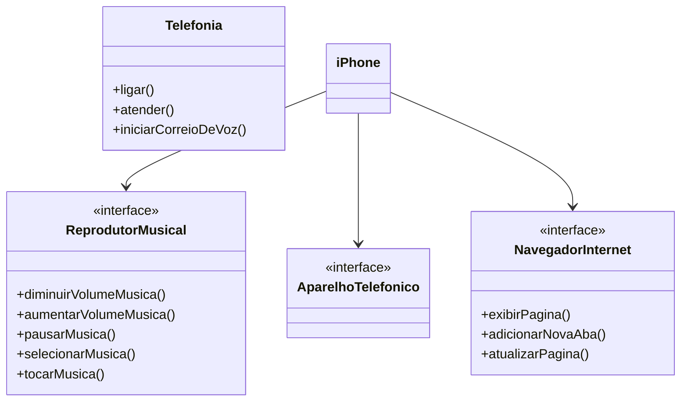

# dio-trilha-java-desafio-uml

```mermaid
classDiagram
    class ReprodutorMusical {
        +diminuirVolumeMusica()
        +aumentarVolumeMusica()
        +pausarMusica()
        +selecionarMusica()
        +tocarMusica()
    }

    class Telefonia {
        +ligar()
        +atender()
        +iniciarCorreioDeVoz()
    }

    class NavegadorInternet {
        +exibirPagina()
        +adicionarNovaAba()
        +atualizarPagina()
    }

    class iPhone {
    }

    iPhone --> ReprodutorMusical
    iPhone --> AparelhoTelefonico
    iPhone --> NavegadorInternet

class ReprodutorMusical
<<interface>> ReprodutorMusical

class AparelhoTelefonico
<<interface>> AparelhoTelefonico

class NavegadorInternet
<<interface>> NavegadorInternet
```
